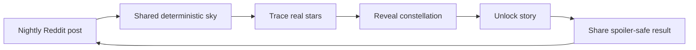

# TaaraNight

**One night. One constellation. One story.**

TaaraNight is a daily shared constellation game built for Reddit's Games with a Hook Hackathon. Every evening, the subreddit gets one sky. Players connect real stars, avoid Glitch decoys, reveal the night's constellation, and unlock a quiet bedtime myth. The result is spoiler-safe and shareable, so the community can compare the night without ruining the reveal.

This repository represents the hackathon/submission build. The expanded project version lives in [`jayasrisng/taara-night`](https://github.com/jayasrisng/taara-night).

## Why it fits Reddit

- **One shared daily post:** everyone plays the same sky for the night.
- **Spoiler-safe sharing:** share cards reveal effort, mood, and Jwala streak without naming or drawing the constellation.
- **Community progress:** the menu and results show a shared star milestone for the night.
- **Retention loop:** Jwala streaks, My Sky collection, and nightly unlocks give players a reason to return.
- **Cozy by default, competitive by choice:** Easy is a guided first sky; Hard adds Glitches and a timer for leaderboard players.

## How to play

1. Open the nightly TaaraNight post.
2. Choose **Easy** for the intended first run.
3. Trace between real stars to connect the constellation.
4. Use Whispers on Medium/Hard if you need a hint.
5. Reveal the constellation, read the story, then share a spoiler-safe card.

## Product loop



## Highlights

- **Hook:** a Wordle-like daily ritual, but tactile and visual: connect stars, reveal a myth.
- **Delightful UX:** procedural sky, ghost-trace tutorial, hologram reveal, soundscape, read-aloud support, and reduced-motion Stillness.
- **Polish:** responsive Phaser UI, custom vector icons, high-DPI mobile rendering, and a single design-token system.
- **Reddit-native design:** nightly post, user-attributed share comments/posts, community star milestones, soft leaderboards, and streaks.
- **Phaser implementation:** custom starfield rendering, one-stroke tracing, deterministic puzzle generation, and a pannable/zoomable My Sky chart.

## Tech stack

- Reddit Devvit web app
- Phaser 4
- TypeScript
- Hono server routes
- Devvit Redis for results, streaks, leaderboards, and post-night mapping
- Vite build pipeline

## Local development

Use Node `22.12+`. This repo was verified locally with Node `22.19.0`.

```bash
npm install
npm run type-check
npm run lint
npm run test
npm run build
```

Run a Reddit playtest:

```bash
npm run login
npm run dev
```

The app is configured for `r/taara_connect_dev` during development. The submission community is intended to be `r/TaaraNight`.

## Data and attribution

Constellation stars use real J2000 positions and designations. Star names are based on the IAU Catalog of Star Names where available, with HYG Database v4.1 fallback data. HYG Database is CC-BY-SA; see <https://github.com/astronexus/HYG-Database>.

All constellation stories, UI art, icons, sounds, and reveal effects are original/procedural for this project.
